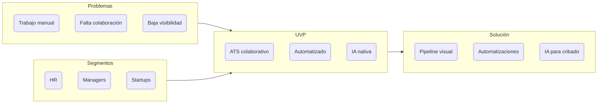
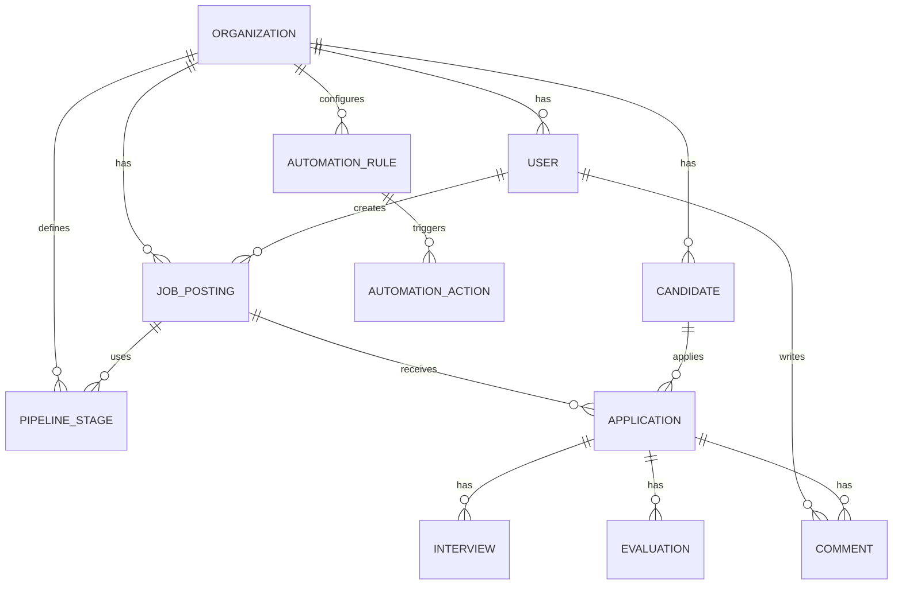
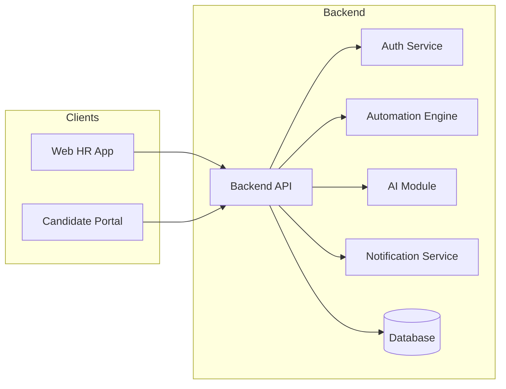
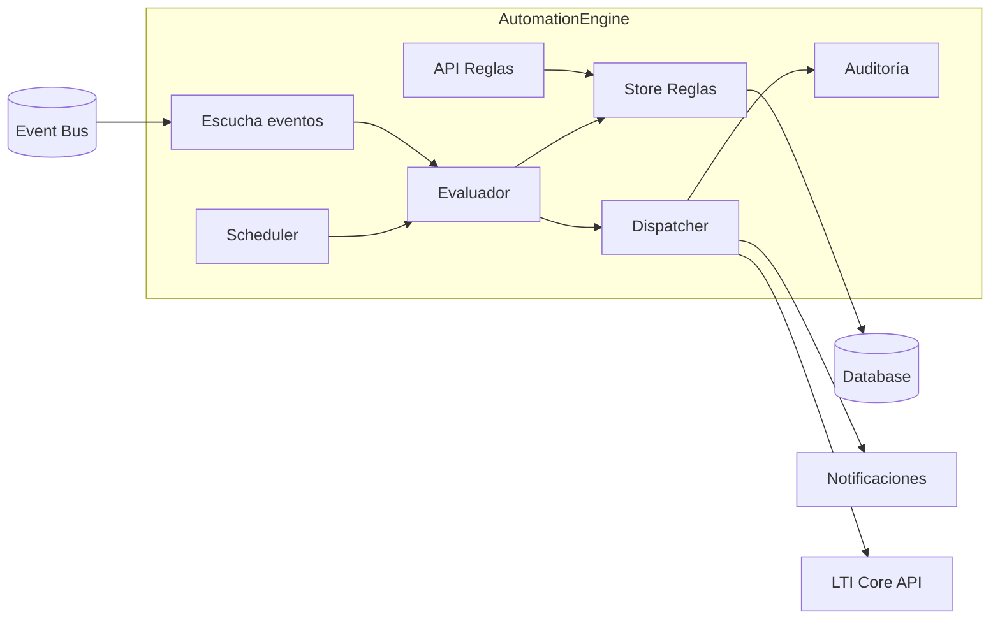

# LTI ATS – Documento de Diseño v1 (Completo)

## 0. Metadatos del documento
- **Producto:** LTI – Applicant Tracking System (ATS)
- **Versión:** v1
- **Responsable:** Equipo de Producto (PM + Tech Leads)

---

## 1. Índice del documento
1. Metadatos  
2. Convenciones  
3. Introducción  
4. Descripción del software LTI  
5. Valor añadido y ventajas competitivas  
6. Funcionalidades principales  
7. Lean Canvas  
8. Casos de uso principales  
9. Modelo de datos  
10. Diseño del sistema (alto nivel)  
11. Diagrama C4 del Automation Engine  
12. Siguientes pasos  

---

## 2. Convenciones y formato
- Markdown `.md`  
- Diagramas en **Mermaid**  
- Entidades en PascalCase, campos en camelCase  

---

## 3. Introducción y contexto
Los procesos de selección actuales presentan ineficiencia, coordinación deficiente, gran carga manual y poca visibilidad.  
LTI aspira a ser el **ATS del futuro**, optimizando eficiencia, colaboración y automatización con IA.

---

## 4. Descripción breve de LTI ATS
LTI es un ATS moderno para equipos de People/HR y hiring managers.  
Su objetivo: **acelerar contrataciones con un sistema colaborativo, automatizado y asistido por IA**, reduciendo la fricción operativa.

---

## 5. Valor añadido y ventajas competitivas

### 5.1 Valor añadido
- Eficiencia para HR mediante automatizaciones.  
- Colaboración en tiempo real.  
- IA asistiva para cribado, resúmenes y redacción.  
- UX moderna enfocada a productividad.  
- Analítica accionable.  

### 5.2 Ventajas competitivas
- Automatizaciones no-code.  
- IA nativa integrada en todo el proceso.  
- Colaboración entre recruiters y managers desde el diseño.  
- Configuración simple pero potente.  
- Arquitectura preparada para escalar.

---

# 6. Funcionalidades principales

## 6.1 Gestión de ofertas
- Creación, edición, publicación.  
- Redacción asistida por IA.  
- Publicación en portal de candidatos.  

## 6.2 Gestión de candidatos
- Perfil unificado.  
- Extracción automática de CV.  
- Búsqueda avanzada.  

## 6.3 Pipeline de selección
- Pipeline configurable.  
- Vista tipo tablero.  
- Cambios drag-and-drop.  

## 6.4 Colaboración
- Comentarios, menciones, scorecards.  
- Notificaciones.  

## 6.5 Automatizaciones
- Motor no-code.  
- Triggers: cambios de etapa, eventos temporales.  
- Acciones: emails, mover etapas, avisos.  

## 6.6 IA asistiva
- Resumen de CV.  
- Análisis de match.  
- Redacción de ofertas y emails.  

## 6.7 Entrevistas
- Programación de entrevistas.  
- Integración con calendarios.  

## 6.8 Mensajería
- Emails automáticos y manuales.  
- Historial centralizado.  

## 6.9 Portal del candidato
- Listado de ofertas.  
- Aplicación online.  
- Seguimiento de candidatura.  

## 6.10 Analítica
- Funnel, conversión, tiempo por etapa.  

## 6.11 Configuración
- Roles y permisos.  
- Pipelines personalizados.  

---

# 7. Lean Canvas Completo

## Tabla Lean Canvas
| Bloque | Contenido |
|--------|-----------|
| Problema | Trabajo manual, poca colaboración, baja visibilidad |
| Segmentos | HR, managers, startups, medianas |
| UVP | ATS colaborativo + automatizaciones + IA |
| Solución | Pipeline visual, IA, automatizaciones |
| Canales | Digital, partners |
| Ingresos | SaaS |
| Costes | Infraestructura, IA, soporte |
| Métricas | Conversión, time-to-hire |
| Ventaja injusta | IA + colaboración nativa |

## Diagrama Lean Canvas


---

# 8. Casos de uso principales

## Caso 1: Gestión de proceso end-to-end
```mermaid
usecaseDiagram
    actor Recruiter
    actor "Hiring Manager" as HM
    actor Candidato

    Recruiter --> (Crear oferta)
    Recruiter --> (Publicar oferta)
    Candidato --> (Aplicar a oferta)
    Recruiter --> (Mover candidato por pipeline)
    HM --> (Revisar progreso)
```

## Caso 2: Cribado asistido por IA
```mermaid
usecaseDiagram
    actor Recruiter

    Recruiter --> (Ver perfil)
    Recruiter --> (Solicitar resumen IA)
    Recruiter --> (Análisis de match)
    Recruiter --> (Decidir avance)
```

## Caso 3: Colaboración para decisión
```mermaid
usecaseDiagram
    actor Recruiter
    actor "Hiring Manager" as HM

    Recruiter --> (Asignar evaluación)
    HM --> (Rellenar scorecard)
    HM --> (Comentar candidato)
    Recruiter --> (Decisión final)
```

---

# 9. Modelo de datos (completo)

## Diagrama ER


---

# 10. Diseño de sistema a alto nivel

## Diagrama de arquitectura


---

# 11. Diagrama C4 – Automation Engine



---

# 12. Siguientes pasos
- Crear backlog detallado.  
- Especificar APIs.  
- Prototipos UX.  
- Roadmap evolutivo.  

---

**Fin del documento.**
